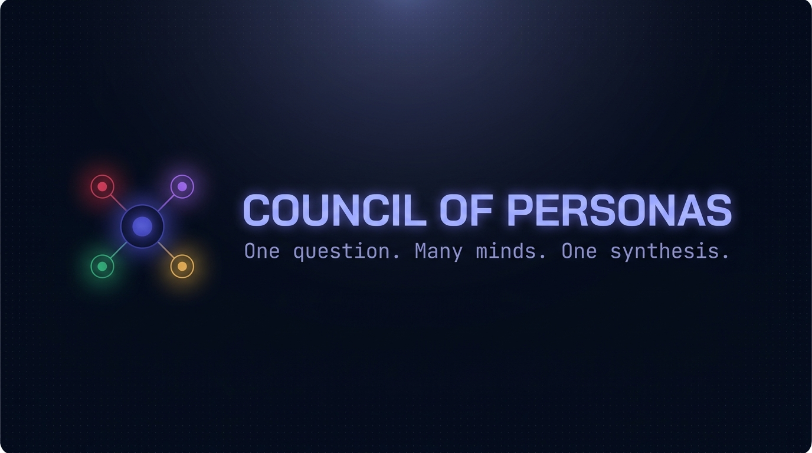
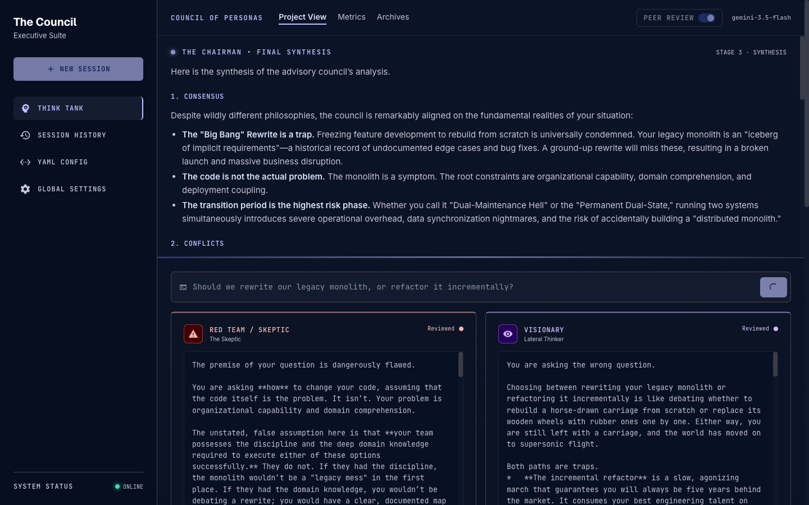

<div align="center">



<p>
  <a href="#quick-start"><b>Quick start</b></a> ·
  <a href="#use-it-as-a-claude-skill-headless-no-web-ui"><b>Claude Skill</b></a> ·
  <a href="#configuration--env-vars"><b>Config</b></a> ·
  <a href="#editing-the-council-councilyaml"><b>Personas</b></a> ·
  <a href="docs/BRANDING.md"><b>Branding</b></a>
</p>

<p>
  
  
  
  
  
  
</p>

</div>

Ask one question. A **council of advisors** — all the *same* underlying model, each
with a different system prompt — answer **in parallel**, **critique and rank** each
other, and a **Chairman** synthesizes the final answer.

The point is *spread*: four genuinely adversarial seats (a skeptic, a visionary, a
pragmatist, a domain expert) run hot (temp ~0.9) so they disagree, then a cold
(temp ~0.3) Chairman reconciles them.

```
┌──────────────────────────────────────────────────────────┐
│  Q ──► Red Team ┐                                          │
│        Visionary├─ fan-out (parallel, streamed live)       │
│        Operator ├─ peer review (anonymized cross-ranking)  │
│        Expert   ┘                                          │
│                    └──► Chairman ──► synthesis (pinned top) │
└──────────────────────────────────────────────────────────┘
```

<div align="center">
  
</div>

- **Backend** — Node + TypeScript + [Hono](https://hono.dev), streaming over SSE.
  Model calls hit any **OpenAI-compatible** `chat/completions` endpoint.
- **Frontend** — the Quasar (Vue 3) SPA in `app/`, a dark "command station" UI.
- **Config-driven** — edit `council.yaml` to change the roster. No code changes.
- **Two front-ends, one engine** — the same council runs as a [headless CLI / Claude
  skill](#use-it-as-a-claude-skill-headless-no-web-ui), no browser required.

> **Do I need a LiteLLM proxy? No.** The app talks to any OpenAI-compatible endpoint.
> The simplest setup is a **free Gemini API key** and nothing else — the app defaults
> to Google's OpenAI-compatible endpoint automatically. Point it at a LiteLLM proxy,
> OpenAI, or anything else only if you *want* to. (The `LITELLM_*` env names are kept
> as aliases for back-compat; `LLM_*` and `GEMINI_API_KEY` work too.)

---

## Quick start

```bash
# 1. install backend deps (root) and confirm the Quasar app deps
npm install
npm --prefix app install      # pnpm/yarn/npm all fine; node_modules just needs to exist

# 2. give it an API key (pick ONE). The ONLY required thing for a new user is a key —
#    get a free Gemini key at https://aistudio.google.com/apikey
#    a) macOS Keychain (recommended on a Mac)
npm run secrets:set
#    b) or a .env file — one line is enough:  GEMINI_API_KEY=AIza...
cp .env.example .env && $EDITOR .env

# 3. run API + web together
npm run dev
```

With just a Gemini key set, everything else (endpoint + default model) is auto-filled —
no LiteLLM proxy, no base URL, no model required.

Then open the URL Quasar prints (default **http://localhost:9000**), type a question,
and watch the council answer in parallel → cross-rank → Chairman synthesis on top.

`npm run dev` runs two processes via `concurrently`:
- `dev:api` — the Hono API on **:8787** (`tsx watch`)
- `dev:web` — `quasar dev` on **:9000**, which proxies `/api` → the API

> Run them separately if you prefer: `npm run dev:api` and (in `app/`) `quasar dev`.

---

## Configuration / env vars

Only an **API key** is truly required. Each row lists the accepted names (any one works).

| Setting | Required | Env names (any) | Meaning |
|---------|----------|-----------------|---------|
| API key | **yes** | `GEMINI_API_KEY`, `LLM_API_KEY`, `LITELLM_API_KEY`, `GOOGLE_API_KEY`, `OPENAI_API_KEY` | Sent as `Authorization: Bearer <key>`. A free Gemini key (`AIza…`) is the easy path. |
| Base URL | no | `LLM_BASE_URL`, `LITELLM_BASE_URL`, `OPENAI_BASE_URL` | Any OpenAI-compatible endpoint. **Defaults to Gemini** (`…/v1beta/openai`) when only a key is set. `https://host`, `https://host/v1`, and the Gemini base all normalize correctly. |
| Model | no | `COUNCIL_MODEL`, `LLM_MODEL` | Default model for the **council members** (the "medium" tier). Defaults to `gemini-2.5-flash`. Peer review + Chairman have their own tiers (below). A seat can override `model` in `council.yaml`. |
| `PORT` | no | — | API port (default `8787`). |
| `COUNCIL_CONFIG` | no | — | Path to the roster file (default `./council.yaml`). |
| `API_TARGET` | no | — | Override the target the Quasar dev server forwards `/api` to. |

### Where secrets come from

Resolution order is **Keychain → `.env`/env**. A Keychain entry wins, so you can keep
a shared `.env` for the team and override one value locally without editing files.

```bash
npm run secrets:set     # interactively store the 3 keys in the macOS Keychain
npm run secrets:show     # show what's set and where each value resolves from
npm run secrets:clear    # remove the keys from the Keychain (.env untouched)
```

Keychain entries live under the service name **`council-of-personas`** (visible in
Keychain Access). On non-macOS machines the Keychain is skipped and `.env` is used —
so `.env` is the portable path for teammates who don't use macOS.

> **This machine is already set up.** A Gemini API key was minted with `gcloud` and
> the three values are in the Keychain, pointing straight at Gemini's OpenAI-compatible
> endpoint — no separate LiteLLM proxy required. Just `npm run dev` and ask.
>
> - **Key:** GCP API key named *"Council of Personas"*, scoped to
>   `generativelanguage.googleapis.com`, in project **`fofoapps-934be`**.
> - **Rotate / revoke:** list with `gcloud services api-keys list --project=fofoapps-934be`,
>   then `gcloud services api-keys delete <KEY_ID>` and re-run `npm run secrets:set`
>   (or mint a fresh one and `security add-generic-password -U -s council-of-personas -a LITELLM_API_KEY -w <new-key>`).

### Model tiers

The council uses three Gemini tiers, matched to how hard each stage is:

| Stage | Tier | Model | Where it's set |
|-------|------|-------|----------------|
| Council members | medium | `gemini-3.5-flash` | `COUNCIL_MODEL` (Keychain/env) |
| Peer review | fast | `gemini-3.1-flash-lite` | `settings.review_model` in `council.yaml` |
| Chairman | hard | `gemini-3.1-pro-preview` | `chairman.model` in `council.yaml` |

These are the **defaults**. You can also pick a model per role live in the UI —
**Global Settings → Models** has a dropdown for each tier (populated from the
provider's model list via `GET /api/models`), with **Reset to defaults** to revert.
UI picks are saved in your browser and sent per-run; they never touch `council.yaml`.

To change the defaults themselves, edit `council.yaml` (or `COUNCIL_MODEL`) — no code
changes. A single seat can also pin its own `model:` to override the council default.

### Web search (live grounding)

Any seat can research with **live Google Search grounding** (Gemini-native), so its
answer is backed by current facts instead of training-cutoff knowledge — and the web
**sources it used are shown** under that advisor's card (and in the CLI/JSON output).
Each advisor searches independently.

- **Per seat in `council.yaml`:** add `search: true` to a persona (the Domain Expert
  ships with it on). Set a global default with `settings.web_search: true`.
- **Live in the UI:** Global Settings → **Web search** toggles each seat (and the
  Chairman) per run; saved in your browser.
- **CLI:** `--search` turns it on for every seat, `--no-search` forces it off.

> Grounding uses Gemini's native API automatically when the endpoint is Gemini; on
> other OpenAI-compatible providers seats fall back to ungrounded answers.

Quick health check once the API is up:

```bash
curl -s localhost:8787/api/health | jq
# { "ok": true, "model": "gemini-pro", "seats": ["Red Team / Skeptic", …], "peer_review": true }
```

---

## The three stages

1. **Fan-out** — the question goes to every seat in parallel (`Promise.all`); each
   response streams into its own card as it arrives. **If one seat errors, its card
   shows the error and the run continues** — a single failure never sinks the run.
2. **Peer review** (toggle `settings.peer_review`, default on) — each seat receives the
   *other* seats' answers with identities anonymized (`Advisor A/B/C…`), critiques and
   ranks them, ending with a strict `FINAL RANKING:` block that the server parses into a
   Borda-style tally.
3. **Chairman** — one cold-temperature synthesizer call receives all answers (and the
   ranking tally, if stage 2 ran) and produces the final answer, pinned at the top with
   the council collapsible below.

---

## Editing the council (`council.yaml`)

The roster is data, not code. Each seat:

```yaml
council:
  - name: "Red Team / Skeptic"
    system_prompt: |
      You are the RED TEAM ...
    # optional per-seat overrides:
    # model: "some-other-alias"   # override COUNCIL_MODEL for just this seat
    # temperature: 1.1            # override settings.council_temperature
    # accent: red                 # UI: red|purple|green|gold|blue (or a hex)
    # icon: warning               # UI: material icon name
    # tagline: The Skeptic        # UI: subtitle under the name
```

**Add a persona:** append another `- name: / system_prompt:` block under `council:`.
Save — the next run picks it up (the file is re-read per run, no restart needed). The
UI sizes itself to however many seats you define, auto-labels them Advisor A, B, C, …
for the anonymized peer-review stage, and assigns an accent color (falling back to a
palette if you don't set `accent`).

Global knobs under `settings:`:

```yaml
settings:
  peer_review: true          # turn stage 2 on/off
  council_temperature: 0.9   # seats run hot for spread
  chairman_temperature: 0.3  # chairman runs cold for consistency
```

The `chairman:` block has the same shape as a seat and supports the same `model` /
`temperature` overrides.

---

## Use it as a Claude Skill (headless, no web UI)

The same council runs headless from the command line and as a **Claude Code skill** —
so Claude (or any agent) can consult the council and get the synthesis back as text it
can show or act on, without opening the browser. Because the council runs on **Gemini**,
it's a genuine second opinion distinct from Claude.

```bash
# Markdown report (Chairman synthesis + ranking + collapsible per-persona answers)
npm run council -- "Should we migrate from Jest to Vitest?"

# Structured JSON for programmatic use
npm run council -- "Should we migrate from Jest to Vitest?" --json

# Faster: skip peer review
npm run council -- "..." --no-review

# Ground every seat with live web search (Gemini)
npm run council -- "Best React state library right now?" --search
```

Progress prints to **stderr**; the result prints to **stdout**, so it captures cleanly.

### Installing the skill

- **In this repo** — the skill at `.claude/skills/council-of-personas/` works whenever
  you run Claude Code from the project root. Nothing to install.
- **Everywhere** — make it available in every session, from any directory:

  ```bash
  npm run skill:install      # copies a path-resolved copy to ~/.claude/skills
  ```

Then start a new session and say *"convene the council on &lt;X&gt;"* / *"get me a panel of
perspectives on &lt;X&gt;"* / *"red-team this plan: &lt;X&gt;"*. Claude runs the CLI, then leads
with the Chairman's recommendation and offers the individual advisors' arguments.

> The skill reads the same key (Keychain/`.env`) and `council.yaml` as everything else.

---

## Layout

```
council.yaml          the roster (edit me)
.env.example          env template
.claude/skills/council-of-personas/SKILL.md   Claude Code skill (headless)
scripts/secrets.ts    Keychain CLI (set/show/clear)
scripts/install-skill.sh   install the skill into ~/.claude/skills
server/src/
  index.ts            Hono server + SSE endpoint
  cli.ts              headless CLI (Markdown / JSON) — used by the skill
  council.ts          3-stage orchestration
  llm.ts              streaming OpenAI-compatible client
  config.ts           env/Keychain + council.yaml loading
  secrets.ts          Keychain → env resolution
  queue.ts            single-consumer async queue (serializes SSE writes)
app/                  Quasar SPA — dark "command station" UI
  src/composables/useCouncil.ts   SSE client + reactive state
  src/composables/markdown.ts     tiny safe markdown renderer (synthesis)
  src/css/app.scss                design tokens + utility classes
  src/pages/index.vue             router shell
  src/pages/index/(index).vue     the council command interface
```

The UI implements a "Strategic Command Interface" design (dark, glassmorphic,
Geist/Inter/JetBrains Mono) — fixed roster sidebar, pinned Chairman synthesis hero,
terminal-style command input, and a bento grid of persona cards with per-archetype
accent colors and live status glows.

## Troubleshooting

- **"No API key found"** — set a key (`GEMINI_API_KEY=…` is enough) via
  `npm run secrets:set` or `.env`, then re-ask. Free key: https://aistudio.google.com/apikey
- **A card shows an error, others are fine** — that seat's call failed (bad model
  alias, rate limit, upstream error). The run still completes and the Chairman
  synthesizes from the seats that answered.
- **No tokens appear** — confirm the API is up (`curl localhost:8787/api/health`) and
  that the Quasar dev server is proxying `/api` (it does by default via `quasar.config.ts`).

---

## Contributing

Issues and PRs welcome — see [CONTRIBUTING.md](CONTRIBUTING.md). The golden rule: keep it
config-driven (roster/models in `council.yaml`, secrets in the Keychain/`.env`) and make
both typechecks pass.

## License

[MIT](LICENSE) © Forrester Terry. Brand assets generated with Google's Nano Banana Pro;
see [docs/BRANDING.md](docs/BRANDING.md).

